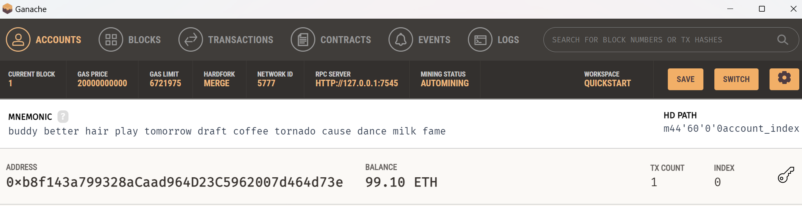
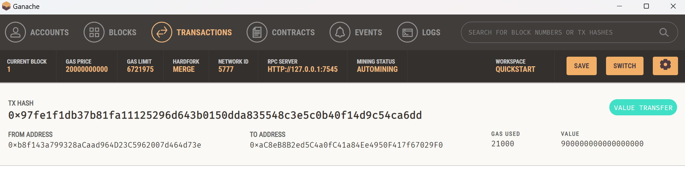
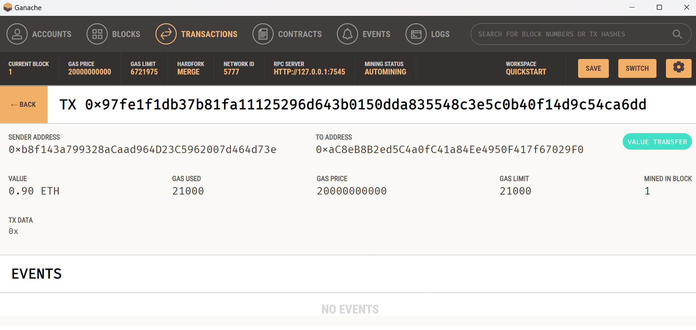

# KryptoJobs2Go

KryptoJobs2Go is an application that customers can use to find fintech professionals from among a list of candidates, hire them, and pay them with cryptocurrency using the Ethereum blockchain network.

## How it works

The following steps were carried out:

* Generate a new Ethereum account instance by using the mnemonic seed phrase provided by Ganache.

* Fetch and display the account balance associated with your Ethereum account address.

* Calculate the total value of an Ethereum transaction, including the gas estimate, that pays a KryptoJobs2Go candidate for their work.

* Digitally sign a transaction that pays a KryptoJobs2Go candidate, and send this transaction to the Ganache blockchain.

* Review the transaction hash code associated with the validated blockchain transaction.

## Inspecting the application

### KryptoJobs2Go application is launched:

### A candidate (Lane) is selected and the number of hours (4.50) is entered. The Total Wage in Ether (0.9) is calculated and shown:

### A successful transaction is sent to Lane. Total wage in Ether is calculated and sent. A validated Transaction Hash is shown. 

### My Ethereum balance is shown:

### Transaction details on Ganache:

### Recipient’s address balance and history from my Ganache application:

We have created a successful application!